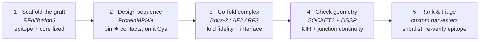

# Coiled-Coil-Stabilised Cytokine Mimics

**A computational protein-design case study: replacing a native disulfide with a de novo coiled coil so a disulfide-dependent cytokine can be manufactured in _E. coli_.**

`RFdiffusion3` · `ProteinMPNN` · `Boltz-2` · `AlphaFold3` · `RF3` · `SOCKET2` · `DSSP` · `HTCondor`

> **Scope & confidentiality.** This repository documents design **reasoning, methods, and tooling** only. The target is referred to throughout as the **POI** (protein of interest); its identity, all designed sequences, campaign yields, library composition, and unpublished results are intentionally withheld. Everything here is built on public methods and public structural/mutagenesis data for the POI.

---

## TL;DR

The POI is a small, **disulfide-stabilised helical cytokine** — a validated drug scaffold, but an awkward one to produce because its fold depends on disulfide bonds that don't form in the reducing _E. coli_ cytoplasm. This project designs a **compact mimic** that reproduces the receptor-binding epitope but trades the fragile disulfide staple for a **de novo antiparallel coiled coil**, so stability comes from non-covalent packing instead of chemistry that bacteria can't do.

The work is a full **design → build → test-in-silico** loop with open-source tools: diffuse the graft, design the sequence, co-fold the complex across multiple predictors, filter on coiled-coil geometry, and triage a large pool down to a short, defensible order list — treating every computational score as a hypothesis, not ground truth.

---

## The problem

The POI is held together by chemistry the host can't reliably reproduce:

- Its fold is stapled by **native disulfide bonds**, and it is normally **glycosylated**.
- Disulfides form in an **oxidising** compartment. The _E. coli_ cytoplasm is **reducing** — the bonds don't form dependably, so cytoplasmic expression drifts toward misfold and inclusion bodies.

That's the wall between a good structure and a cheap, iterable, animal-free supply.

```
        NATIVE CAP                       COILED-COIL GRAFT
      ┌───┐   ┌───┐                       ╲ ╱   ╱ ╲
      │   │╌S─S╌│   │        ──graft──▶     ╳     ╳       (antiparallel
      │   │     │   │                     ╱ ╲   ╲ ╱        knobs-into-holes)
      └───┘     └───┘                       ▼     ▲
   needs an oxidising                  packing, not chemistry
     compartment                          → folds in E. coli
   ┌─────────────────┐                ┌─────────────────┐
   │ POI core ·★epitope│               │ POI core ·★epitope│   (epitope held fixed)
   └─────────────────┘                └─────────────────┘
```

## The design thesis

**Don't fight the chemistry — remove the dependency on it.** Replace the disulfide-stabilised cap with a de novo **antiparallel coiled coil** that fills the same structural role through knobs-into-holes packing, then clean out the now-orphaned cysteines. A fold that never needed an oxidising compartment can be built in bacteria.

Coiled coils are the right stabiliser to trade in because they are **designable and predictable**: heptad-repeat sequences fold into helix bundles whose orientation, register, and interface can be specified up front and then verified directly from coordinates. It's the most characterised motif in protein design — a dependable part swapped in for a fragile covalent one.

---

## Cysteine cleanup — remove the cysteines, keep what they did

Deleting a disulfide is not a find-and-replace to serine: each cysteine has a structural role, and a leftover free thiol is a liability (it oxidises, cross-links, scrambles). Substitutions were chosen from sequence homology and the folding literature, not by default:

| Cysteine | Substitution | Rationale |
|---|---|---|
| Loop cysteine | **→ Pro** | A convergent natural substitution: proline appears at this position across independent mammalian lineages and **pre-organises the adjacent loop** for a slow folding step, taking over the disulfide's structural job. |
| Its partner | **→ Ser** | Left unpaired once the loop cysteine becomes Pro. Serine is the conservative, non-reactive fill. |
| Graft-orphaned cysteine | **→ Ser** | Orphaned when the coiled-coil graft replaces its partner. Neutralised to serine as a first pass; a co-designed fill is the follow-up. |

Throughout, the **receptor-contact hotspot residues** — the positions validated by alanine-scanning mutagenesis as critical for binding — are held **byte-identical**. Everything is engineered _around_ the epitope, never through it.

---

## Designing the coil — verified, not assumed

The stabiliser only works if it is a **real** coiled coil in the right orientation. Three deliberate choices, each verified from structure:

### 1. Antiparallel, alternating-charge
An antiparallel bundle points both helices back toward the POI body, so the graft **extends the terminal helix** instead of projecting away from it. Charges are alternated along the interfacial `e`/`g` positions so each strand is close to **net-neutral** (avoiding a highly charged, aggregation-prone surface) while the _pairing_ stays electrostatically complementary. Each coil was designed to spec and then checked: near-zero net charge per strand, interface electrostatics still favourable.

```
   helix 1  →                         ←  helix 2   (antiparallel)
        a·b·c·d·e·f·g                  g·f·e·d·c·b·a
        ▲       ▲                          ▲       ▲
      core    core   ── a/d interface ──  core    core     knobs-into-holes
       (a,d packing)                                       e/g carry the charges
```

### 2. Verified as a coil (SOCKET2 knobs-into-holes)
Design intent isn't evidence. KIH packing was confirmed with **SOCKET2** on every candidate **and on its independent co-fold**, so the register has to survive prediction, not just diffusion. One catch shapes the whole QC step:

> **Method insight.** The POI's own helix bundle registers as knobs-into-holes too. Running SOCKET on the whole complex would score the native core as "a coil" and flatter every design. The fix is to **excise the two graft helices into an isolated two-chain model** and test that — so the KIH call is attributable to the graft, not the scaffold.

The consequence was clarifying: essentially _every_ designed coil passed the KIH test, so "is it a real coil" stopped discriminating — and the filter that mattered moved downstream, to whether the coil could be **joined to the POI cleanly**.

### 3. A standardised register → the coil becomes a swappable part
Locking the heptad register to one convention turns the coil library into interchangeable cassettes: a single adaptor design transfers across coils of different length and topology, because they all leave the POI on the same axis at the same phase. That's what makes a real screening library (hundreds of coils × adaptor variants) tractable to build **modularly** instead of one-off.

---

## The junction — the hard part is the weld, not the coil

Grafting is a geometry problem. The coil must meet the POI helix through a short adaptor that ideally reads as **one continuous α-helix**, so the graft is rigid and the epitope doesn't wobble. Two findings from the coordinates drove the design:

- **Continuity, measured — not eyeballed.** A good adaptor resolves as clean helix or clean loop; a bad one shows strained 3₁₀ / π / strand signatures at the junction. This was scored with **DSSP** per design — and an earlier crossing-angle metric was **deprecated** once it disagreed with DSSP on most designs by passing welds that were collinear but internally distorted.
- **The scaffolder silently re-docks the coil.** Coils placed ~20 Å _off_ the POI still came back as continuous chains — motif-scaffolding rigid-body pulls the coil inward to close a short linker. So adaptor **length steers geometry**: to keep a long straight weld, the coil has to start farther out. Non-obvious, and only visible by comparing input vs output coordinates.

Underneath sits an honest open question: **must the weld be a rigid continuous helix, or can it be flexible?** The literature says target-dependent, so rather than assume, it's set up as an explicit test — rigid-helix, helical-linker (`EAAAK`), and flexible (`GGGGS`) adaptors on the same cores — to be decided by assay, not preference.

---

## The pipeline — design → fold → filter, at pool scale

The point of the tooling is triage: turn a large diffusion pool into a short, defensible order list. Stages run as reproducible **HTCondor DAGs** (fan-out scaffold → sequences → folds, checkpointed per stage), so a campaign of tens of thousands of designs is bookkeeping rather than heroics.



---

## Reading the scores with scepticism

The most useful thing here isn't a model — it's the discipline to not believe one. Concrete places a score would have misled me, and the control that caught it:

- **The interface score was uninformative for this system — even on the real thing.** Folding the wild-type complex as a control, a validated predictor scored the _native_ complex at the same low interface confidence (ipTM) as the designs. The number wasn't reporting failure; it just doesn't discriminate for this target. That control is what justified trusting a different predictor's ranking instead of discarding good designs.
- **Predictors disagree on binding, and the disagreement is data.** When one folder liked the monomer fold but folders split on receptor engagement, those designs were labelled **"geometry-correct, not validated binders"** — a distinct, weaker claim — rather than promoted. Cross-folder agreement, not a single ipTM, is the gate.
- **A plausible metric can be quietly wrong.** The first junction-quality metric passed welds that were collinear but internally distorted; it disagreed with DSSP on the majority of designs, so it was retired. A score you can't reconcile against structure is a score you shouldn't ship.
- **In silico ≠ real.** Continuity, KIH, ipTM, RMSD narrow the pool; they don't confirm expression, stability, or binding. The whole design is built to hand off to a wet-lab readout — surface display + labelled-receptor sorting — that reports **folded and functional in one gate**.

---

## Tooling built along the way

| Tool | What it does |
|---|---|
| **Fan-out DAGs on HTCondor** | Scaffold → 2 sequences → fold → score, checkpointed per stage, unique per-chunk outputs (the scheduler overwrites same-name transfers), smoke-tested on one pose before spending on tens of thousands. |
| **Fast CIF parser** | The stock MMCIF parser took ~10 s/structure (hours across a campaign); a hand-rolled `_atom_site` reader with a label/auth-numbering fallback cut it to seconds with no silent misalignment. |
| **SOCKET2 for arm64** | Ported the knobs-into-holes analyser to run locally on Apple silicon, wired to `mkdssp`, wrapped for batch use with the excise-to-two-chains step built in. |
| **HyperMPNN as a drop-in arm** | Added thermostable-retrained MPNN weights as a parallel design arm — with the caveat that _hyperstable_ and _hypersoluble_ pull opposite ways on the surface, so ranking decides rather than dogma. |

---

## Skills demonstrated

- End-to-end use of modern **open-source design methods** (RFdiffusion3, ProteinMPNN) and **structure predictors** (Boltz-2, AlphaFold3, RF3) on a real receptor-binding target.
- Building **triage tooling** — structure prediction, geometry checks, ranking — that cuts a large design pool to a short synthesis list.
- **Scepticism beyond in-silico metrics**: wild-type controls, cross-predictor agreement, retiring a bad metric — scores treated as evidence to interrogate, and designs built to hand off cleanly to a wet-lab readout.
- **Reproducible compute**: parameterised HTCondor DAGs, checkpointing, and QC pipelines that scale to tens of thousands of designs.

---

## Repository layout

> _To be populated when the public repo is set up. Suggested structure:_

```
.
├── README.md                # this file
├── pipeline/                # RFd3 → MPNN → fold DAG generators + run scripts
├── geometry/                # SOCKET2 (KIH) + DSSP continuity analysis
├── scoring/                 # fold harvesters, cross-predictor ranking, triage
├── tools/                   # fast CIF parser, SOCKET2 arm64 build, helpers
└── figures/                 # schematics (no proprietary structures)
```

---

_By **Jack Archer** · University of Wisconsin–Madison · 2026._
_Built on public methods and public structural/mutagenesis data for the POI. No proprietary sequences, structures, yields, or library designs are included._
